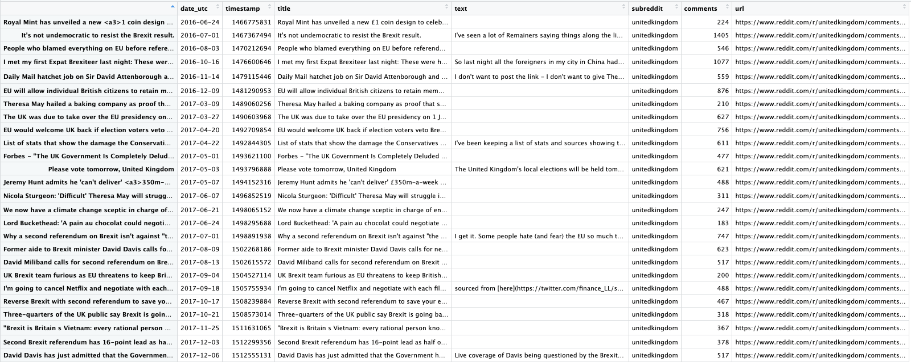
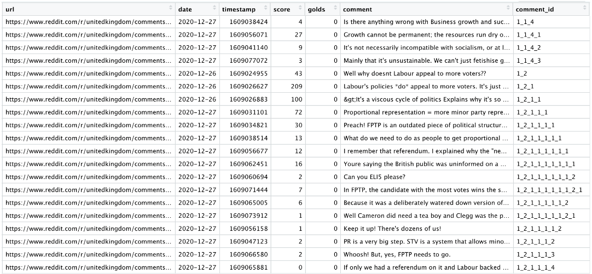
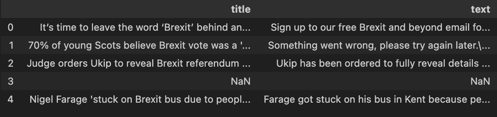
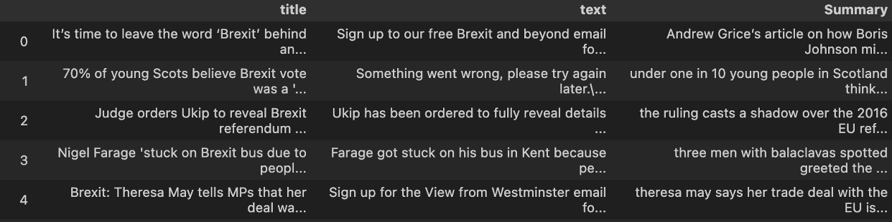
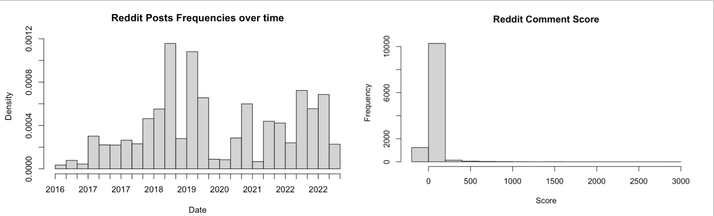
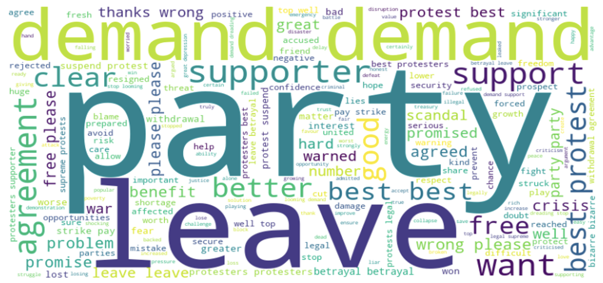
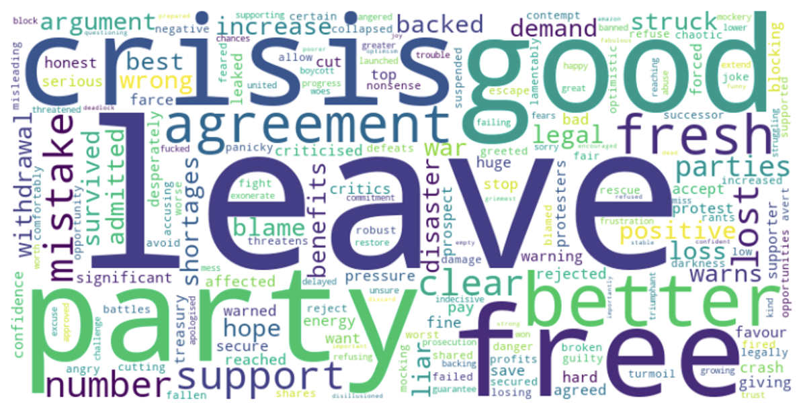
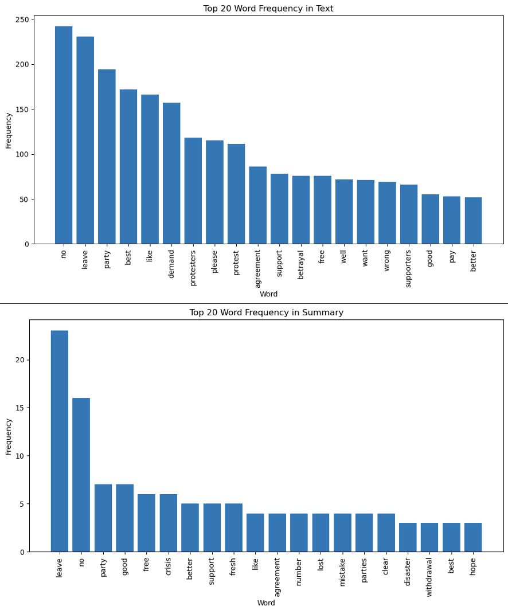
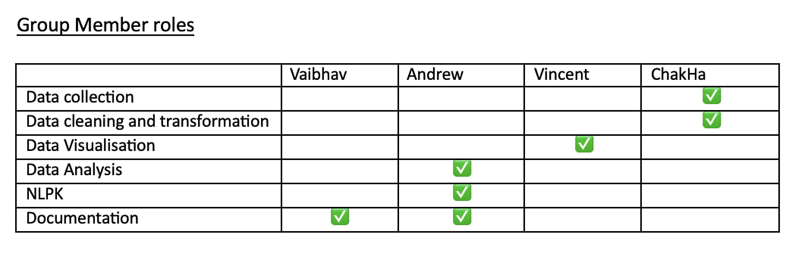

Group members: Vaibhav V, Andrew Pei, Vincent Wei, ChakHa Yeung

# 1. Introduction 

## 1.1 What is Brexit 
Brexit, a contraction of "British exit," signifies the process by which the United Kingdom (UK) disengages from its membership in the European Union (EU). This consequential event was set into motion by a referendum held on June 23, 2016, and officially materialized on January 31, 2020. Since its inception in 2016, Brexit has become arguably the most divisive topic in UK politics, leading to the resignation of former Prime Minister David Cameron and profoundly shaping the policies of subsequent Prime Ministers.

Notably, the Brexit campaign distinguished itself through its pioneering utilization of technology. Engaging in lively debates, the discourse spanned across prominent social media platforms such as Twitter, Facebook, and YouTube. These platforms, owing to their extensive reach and convenient means of communication, facilitated a widespread exchange of opinions. In addition to social media, technology played a pivotal role in the Brexit campaign through the employment of targeted advertisements leveraging data analytics and profiling, as well as the development of dedicated campaign applications.

It is worth recollecting that the outcome of the Brexit referendum came as a surprise to many pollsters, who had expressed confidence that the prevailing sentiment would lean towards remaining within the European Union. This unexpected turn of events raises questions about the methodologies employed by pollsters in gauging public sentiment and prompts a closer examination of their approaches.

## 1.2 What is the motivation for our study
Our decision to explore this topic stemmed from several key questions that surfaced in our inquiry:
* How has sentiment surrounding Brexit evolved over a span of three years? Is it accurate to assert that opposition to Brexit has grown over time?
* Can polls effectively capture the sentiment around Brexit, considering their limited reach and the specific demographic they target?
* Are there discernible differences in sentiment towards Brexit between traditional news outlets and social media platforms?
* Do young people hold distinct perspectives on Brexit compared to the broader population?

## 1.3 Preliminary Investigation
In preparation for our data analysis, it is essential to establish the conclusions presented by news outlets, polls, and existing literature. These preliminary findings form the basis for our research objectives and provide the rationale behind our further investigation.

As evidenced by an [article published in The Guardian](https://www.theguardian.com/politics/ng-interactive/2023/jan/30/changing-attitudes-to-brexit-three-years-on), polling averages suggest a growing belief among individuals that the United Kingdom would be better off as a member of the European Union. This trend, which we aim to substantiate through our data analysis, holds significant implications for understanding the evolving sentiment around Brexit. The article also highlights an intriguing observation regarding the resistance to Brexit among individuals born between 1996 and 2004, warranting further exploration and analysis.

Furthermore, our research is influenced by the examination of poll efficacy in capturing public opinion, as discussed in an [article from FiveThirtyEight](https://fivethirtyeight.com/features/nonresponse-bias-ipsos-poll-findings/). Despite the transformative changes in communication methods and the diverse ways people express their views, traditional polling approaches have remained prevalent. To overcome the limitations of conventional polls, we seek to leverage data from social media platforms, particularly Reddit, to gain more nuanced insights into the sentiments of the general public. This approach is motivated by the understanding that certain demographic groups, such as Reddit users within the 18-29 age range, may be underrepresented in traditional polling methods. The real-time engagement and discussions on Reddit also offer an opportunity to observe the influence of key events, speeches, and advertising campaigns on sentiment.

In our research methodology, we incorporate the analysis of news articles as a pseudo-control group. Recognizing that news outlets often rely on polling data, we aim to explore potential divergences or similarities between the sentiment reflected in traditional media and that observed on social media platforms. This comparison will enable us to gain a comprehensive understanding of the complex dynamics surrounding Brexit and shed light on the difference between opinions and sentiments on traditional news outlets and social media. 

## 1.4 Research Design / Project Flow Diagram
Our project workflow can be summarized in the diagram presented below. To overcome the limitations imposed by Reddit's official API, we utilized an API wrapper called redditExtractoR from the library. This wrapper allowed us to bypass the restrictions and retrieve the desired information and contents of posts. While the number of posts that can be obtained is still limited, redditExtractoR proved to be superior to the default wrapper in terms of extracting the required data.

One significant advantage of redditExtractoR is its capability to restrict the query to specific subreddits, ensuring that comments originate exclusively from our target audience of young British redditors. We specifically chose the unitedkingdom subreddit due to its representation of a wider political spectrum compared to other UK politics-related subreddits. Additionally, this subreddit contains a substantial amount of data points from the desired target group, with the majority of its posts consisting of formal news articles. The post titles often serve as news headlines, with the corresponding news article as the post's content. This feature provided us with a large sample of data, streamlining the data collection process by simultaneously extracting both the news articles and the reactions to them.

However, it is important to acknowledge that this method introduces selection bias. Articles that evoke strong emotions, particularly anger and outrage, are more likely to be posted on Reddit. Despite this limitation, given the project's scope and the challenges of matching separate news articles to Reddit reactions, this approach remains the most concrete way to gain insights into the interaction between redditors and news articles related to Brexit.

The redditExtractoR package simplifies the data collection process, requiring just a single command to extract a comprehensive data frame (top_Brexit_urls) containing the post URL, timestamp, and title text. A second command extracts the post contents into a list of data frames (thread_contents), with the comments indexed in a separate dataframe (df_Brexit). We then filtered for comments that contain the keyword "Brexit," which we will utilize for our subsequent emotional and sentiment analysis.

Following the extraction, both data frames undergo cleaning and wrangling using pandas in Python and the tidyverse package in R. The details of this process will be further elaborated in the cleaning and exploratory data analysis (EDA) section. For subsequent analysis, as described in section 6 with additional justifications provided, we web-scrape the post URLs from the thread_df to obtain the article content. Additionally, the comment_df is preprocessed using tidytext and NLTK to assess both emotions and sentiment.

The final output of our analysis takes the form of visualizations, including line charts, word clouds, and bar charts, among others. These visualizations provide a comprehensive representation of the findings derived from our data analysis process.


     
# 2.Initial Data Collection 

## Reddit Comments Data

Our first data source was the post threads of the united kingdom subreddit. For the extraction of data, we used the Reddit Extractor in RStudio, a wrapper for Reddit's API. This enabled us to directly interact with the Reddit API and bypass some data access limitations, allowing us to easily pull relevant data such as user post title, post url, and upvote to downvote ratios (score). However, there still remains a limit on the number of total posts that can be pulled with if you specify by “top” (229). We ultimately decided against using other parameters, such as “relevant”, because even though it gets more posts (over 900) the overall number of comments is fewer because it pulls lower-engagement posts. It also increases the likelihood of the post not being a news article, which undermines our desired analysis of interacting redditors and news articles. We employed parameters such as time range and subreddit to fine-tune the query for posts. As mentioned in the project flow section, we ultimately choose the unitedkingdom subreddit as it targets a young, but on paper not overly left-wing, online audience. The figure below shows the head of the initial extracted dataframe (Atopbrexiturl) and the code used to obtain the data.  

```r
top_Brexit_urls <- find_thread_urls(subreddit = "unitedkingdom", keywords = "Brexit", sort_by = "top", period = "all"); 
top_Brexit_urls$date_utc <- as.Date(top_Brexit_urls$date_utc)
Atop_Brexit_urls <- arrange(top_Brexit_urls, date_utc)
```


We then used the get_thread_content command to get the content of the post threads by feeding it the url column. This procedure is shown below, with immediate data cleaning performed to remove deleted comments and filtering by comments that only contain Brexit. 
Filtering to only Brexit comments (df_filtered) is done because reddit is notorious for having [unrelated comment threads](https://www.reddit.com/r/AskReddit/comments/5g7apu/why_do_redditors_so_easily_go_off_on_tangents_and/)  not even discussing vaguely related topics. 

```r
threads_contents <- get_thread_content(Atop_Brexit_urls$url) 
df_Brexit <- threads_contents[["comments"]] %>% select(-c("author", "upvotes", "downvotes")) %>% filter(!str_detect(comment, regex("deleted", ignore_case = TRUE))) #index out a dataframe from the thread url, filter out deleted comments. 
df_filtered <- df_Brexit %>% filter(str_detect(comment, regex("Brexit", ignore_case = TRUE))) #exclude to comments that mention Brexit
```


## News Article Data
In our next step, we chose to extract news links connected to the subreddit discussions due to the challenges associated with retrieving older news articles using traditional methods such as News APIs. Given that sentiment analysis on Brexit encompasses a wide temporal range, it becomes increasingly difficult to obtain historical news data through APIs alone.


We were able to identify news links shared by community members. These news links served as references to access relevant articles published during the time of the discussions. We employed Selenium, to navigate to the identified news links and extract the corresponding URLs. This approach allowed us to circumvent the limitations of traditional News APIs and obtain a broader selection of news articles pertinent to our sentiment analysis.

by utilizing the newspaper3k package, we downloaded the news articles associated with the extracted news links. This approach ensured that our dataset includes timely and contextually relevant news content, enhancing the comprehensiveness and accuracy of our sentiment analysis on Brexit.

Note that since some subreddits are not linked to a news article, we put “NaN” as the value for these.
An example of skipped article


Also, some newspaper sources do not allow free access. So, we skipped approximately 10 articles using the try except method demonstrated below.


An example of skipped article


## Cleaning News Article Data
Our obtained news contents presented us challenges with cleaning the data frame due to the presence of a significant amount of noise from website loading, and in the form of advertisements and unrelated text, such as “Sign up to our free Brexit and beyond email for the latest headlines on what Brexit is meaning for the UK. Since different websites have different types of “unwanted texts” we employed the T5 (Text-To-Text Transfer Transformer) model from the Hugging Face's Transformers library to generate summaries of each news article. The T5 model was trained on a diverse range of internet text and can perform a wide variety of NLP tasks, making it a perfect fit for our purpose.
We generated the summary with this code:


And the returned summary looks something like this:
“Andrew Grice’s article on how Boris Johnson might approach the next election overlooks the significant danger that nothing will change. if we want to avoid repeating history then we must put Brexit behind us and refuse to fight yesterday’s battles again.”

This approach helped us condense the articles to their core messages and mitigated the noise issue. It allowed us to obtain a dataset with significantly reduced noise, making it ready for further analysis.

One limitation might be summarisation using the T5 model may have resulted in the loss of some contextual nuances. Nevertheless, it provided us with a significantly cleaned dataset, ready for further analysis.

##Data frame before cleaning



##Data frame after cleaning



## 2.1 EDA of Reddit Comments Dataframe (df_filtered) which contains "Brexit" 
Df_filtered has 11765 rows and 7 columns, with dates of comments ranging between 2016-06-24 to 2023-05-14 and an average "score" ( comment upvotes - downvotes) of roughly 22. We can find the default data types using the str command in R, which shows that only the url and comment columns are characters while the remaining 4 columns are numeric. To get a rough understanding of distributions for our relevant numeric variables, we plotted histograms of the date and score variable. It suggests there is a significant positive skew for the score variable, and and that a majority of the comments occurred in 2018-2019 and 2022-2023. However, we decided not to remove score outliers because engagement in social media platforms tends to be dominated by a small number of posts, so it is not unexpected that the distribution is non-normal. In addition, the score variable is not used as a predictor for emotional classification or sentiment analysis, so most of the results should not be affected. 



## 2.2 EDA of News Articles
We collected 145 news articles from the reddit links. For the subreddit posts that did not link to a news article, we removed them and replaced them with NaN so that they can be filtered out in later analysis. It was difficult to uncover any distributions for the news data frame because it was all qualitative character data types - the comments_df contains some quantitative distributions so the distributions will be discussed more in depth. For this section, we instead decided to play with some frequency diagrams and wordclouds to get an initial perspective on this textual dataset. 

## Word Cloud for Text 



## Word Cloud for Summaries 



The word clouds generated from news texts and news summaries provide consistent insights into the sentiment and key themes surrounding Brexit. In both word clouds, the term "leave" stands out prominently, highlighting the enduring impact of the decision to exit the European Union. The presence of the word "party" in both word clouds suggests the involvement of political parties and their role in shaping the Brexit narrative. Additionally, the word "crisis" in the word cloud for news summaries reflects the persistent challenges and uncertainties associated with Brexit. However, amidst the turmoil, the word "good" emerges, potentially signifying positive aspects or perceived advantages of the situation. Together, these words capture the complexity and multifaceted nature of sentiment and opinions surrounding Brexit, highlighting the ongoing debates and diverse perspectives on this ongoing issue.

## Frequency Table for Text vs Frequency Table for Summaries



The consistency between the two frequency tables further reinforces the prevalent sentiment surrounding Brexit. The fact that the terms "no" and "leave" have the highest frequencies in both tables indicates a common theme of scepticism and a desire for separation from the EU among the news articles that were scraped as a data source. The frequent appearance of "no" suggests resistance or opposition to specific aspects of Brexit, such as proposed policies or negotiation outcomes. This indicates that there are concerns or objections regarding certain elements of the Brexit process. Additionally, the high frequency of "leave" highlights the continued focus on the decision made by the United Kingdom to exit the European Union. It underscores the ongoing discussions and implications associated with this monumental choice. Overall, these consistent results highlight the prevalent sentiments of scepticism, resistance, and attention to the decision to leave the EU in the news articles analysed


# 3. Data Analysis 
## 3.1 Method Choice and Reasoning for Emotional Analysis
### 3.1.1 Emotional Word Clouds Method Reasoning: 
For the word clouds, 2-word tokens were used instead of 1-word ones because it reveals more information about the context under which the phrases were used. For example, in the unigram clouds ‘pretty’ was shown as a common ‘emotional’ word, but it reveals little about the emotional target and is merely an ‘amplifier’ used for emphasis.  Of course, the 2-word case is still flawed in being biased towards common short phrases that also lack meaning, but after selectively filtering out stopwords and non-emotional words it tends to not undermine analysis; only ‘oven-ready’ is left as a vague 2 word-phrase, and even this has some Brexit-related meaning in reference to Boris Johnson’s proclamations of an ‘oven-ready’ Brexit deal. Only the top 50 bigrams were retained so the word clouds are less distracting and more comparable.

### 3.1.2 Emotional Classification Diagrams Method Reasoning: 
Due to time constraints, an off-the-shelf dictionary-based emotional classification model was used. While this model is more advanced than others by being able to account for some negation - for example, “I don’t hate brexit” will be recorded as anger_negated instead of misclassified as anger -  it still fails to detect more nuanced negation such as sarcasm. It records 16 emotions, but only 7 emotions were kept for visualisation. 8 emotions are just their negated counterparts, which are difficult to categorise as positive or negative emotions, while 1, trust, was excluded because it seems prone to misclassification. For example, “I'm not quite sure I agree.” is assigned the highest trust score of 1, even though it suggests uncertainty/trust_negated. Unfortunately, removing ‘one-worders’ was difficult so they were kept, which could potentially distort the analysis. However, one-worders should not be particularly biased towards any emotion and so would only be ‘random noise’. For simplicity and to keep as many comments as possible, only instances where no emotions were recorded were filtered out, so it is possible for each individual sentence in a comment to have multiple emotions as it is just based on the presence of specific dictionary words. For example, the following comment was tagged with the emotions ‘trust’, ‘disgust’, and ‘anger’: 

_“I'm wondering if their support was decided upon because they felt there was no realistic prospect of Corbyn actually pushing for a second vote which would mean it was another way they could oppose Brexit - which they consider likely to be seriously harmful to Scotland - whilst knowing that if no second vote happened then there's no way any future government in Westminster could plausibly argue for referendum on any agreed Scottish independence deal and be taken seriously.” _

## 3.2 Emotional Word Clouds and Classification Implementation: 
We first preprocessed comments by tokenising into word pairs (bigrams) that are separated into two columns, before removing stop words using a dataframe (stop_words) from the tidytext package and ‘non-emotional words’ based on whether it appears in a sentiment dictionary (sentiment).

```r
df_bigrams <- df_filtered %>%
  unnest_tokens(bigram, comment, token = "ngrams", n = 2) %>% #tokenised into bigrams 
  filter(!is.na(bigram)) #removed NA values
bigrams_separated <- df_bigrams %>% separate(bigram, c("word1", "word2"), sep = " ") #separated the bigrams into two word columns to allow the filtering out of stopwords and non-emotional words

custom_stopwords <- c("http", "amp", "https", "gt", "xit", "news", "wiki", "makes", "mail", "brexit") #custom stopwords for specific words not listed in the tidytext dataframe. 
bigrams_filtered <- bigrams_separated %>% 
  filter(!word1 %in% stop_words$word & !word2 %in% stop_words$word) %>% #uses a stopword dataframe from the tidytext package
  filter(word1 %in% sentiments$word | word2 %in% sentiments$word) %>% 
  filter(!word1 %in% custom_stopwords & !word2 %in% custom_stopwords)

bigrams_united <- bigrams_filtered %>%
  unite(bigram, word1, word2, sep = " ")
```
Preprocess comments by tokenising each comment into individual sentences, before running sentimentr’s off-the-shelf emotion() function to get the recorded number of emotional instances for each sentence in a relatively clean dataframe (emotion1). That dataframe is then filtered to remove instances where 0 emotions were recorded for a particular sentence, before additional tidyverse functions were used to wrangle the data frames into a desired format for visualisation. 

```r
emotion1 <- df_filtered %>% sentimentr::get_sentences() %>% sentimentr::emotion() #off the shelf emotional classification
emotion2 <- emotion1 %>% dplyr::filter(emotion_count > 0) %>% arrange(date) %>% #only keep instances where an emotion count was recorded for a comment
  group_by(url, emotion_type) %>% #group by url link (i.e each news article) and emotions 
  summarise(Emotion_Percentage = sum(emotion_count)) %>% 
  pivot_wider(names_from = emotion_type, values_from = Emotion_Percentage) %>% #rows correspond to each post and columns are counts of each emotion. 
  mutate(across(everything(), ~ replace_na(., 0))) %>% data.frame() %>% #removes all NA values
  select(-anger_negated, -fear_negated, -anticipation_negated, -joy_negated, -trust_negated, -sadness_negated, -surprise_negated,-disgust_negated, -trust) %>% #removes selected emotions
   mutate(rowSum = rowSums(select(.,-url)), Date = as.Date(Atop_Brexit_urls$date_utc), Year = year(Date)) %>% 
  arrange(Date) %>% 
  mutate(across(-c("Date","rowSum","url","Year"), ~ (./rowSum*100))) %>% #convert all the emotion count columns into percentages 
  group_by(Year) %>% 
  summarise(across(everything(), mean, na.rm = TRUE)) %>% #get average percentages for each year, warning messages expected as   irrelevant, non-numeric chunks are also summarised 
  pivot_longer(-c("Date","url", "Year", "rowSum"), names_to = "Emotion", values_to = "Percentage") 
```

## 3.2 Method and Implementation of Sentiment Analysis
### 3.2.1 NLTK Sentiment Analysis Reasoning
In conducting sentiment analysis, we employed an NLTK sentiment intensity analyzer to determine polarity scores. This analyzer, trained on social media text, is expected to provide reliable and accurate predictions of sentiment for both Reddit comments and opinions expressed in news articles. However, it is important to acknowledge a notable limitation of sentiment analysis, which lies in its inability to discern contextual nuances. For example, the phrases "I hate Brexit" and "I hate the EU" both exhibit negative sentiment, but they express distinct viewpoints regarding support for Brexit. Therefore, it is imperative to avoid equating negative sentiment towards Brexit with a lack of agreement or support. Nevertheless, when analyzing Reddit comments within the context of sub-Reddits related to news articles about Brexit, we can infer that these comments primarily reflect sentiment regarding factual information. In such cases, the alignment between negative sentiment and disagreement with Brexit is more readily discernible. This observation underscores the importance of considering the specific context in which sentiment analysis is applied, as it enables a more nuanced interpretation of the expressed sentiments within the given domain.

### 3.2.2 NLTK Sentiment Analysis Implementation 
Implementing the desired sentiment analysis can be split into two steps 1) finding sentiment score 2) filtering nouns associated with positive and negative analysis. We will use examples from the code looking at sentiment in new articles, but the same process is applied to Reddit comments as well. 

Prior to conducting sentiment analysis, it is necessary to eliminate irrelevant words that do not contribute to expressing opinions. Neutral words and those lacking meaningful content can significantly bias the sentiment scores, masking the underlying sentiment that we aim to uncover. To address this, we have developed a function for pre-processing textual data, which involves several steps to refine the input. The first step is to convert all words to lowercase to ensure consistency and remove any case-related discrepancies. Additionally, we remove stop words, which are commonly used words with limited semantic value (e.g., "the," "and," "is") that do not contribute to the sentiment expressed. This helps to refine the data by focusing on more meaningful content. Next, we employ lemmatization, a process that reduces words to their base or root form. This step ensures that different grammatical variations of a word are treated as the same entity, providing a more accurate representation of the underlying sentiment. It is important to note that we exclude one-letter words and numbers during lemmatization to maintain the integrity of the data and prevent the loss of relevant information. The function that pre-processes text string is implemented as follows:

```Python
# define function to preprocess text
def text_preprocess(comment):
    try:
        # tokenize comments and preprocess text for sentiment analysis
        preprocessed_tokens = [word.lower() for word in word_tokenize(comment)]        
        preprocessed_tokens = [word for word in preprocessed_tokens if word not in stop_words]        
        preprocessed_tokens = [lemmatizer.lemmatize(word) for word in preprocessed_tokens]        
        preprocessed_tokens = [word for word in preprocessed_tokens if (len(word) > 1) and (word.isalpha()) and (word.isalnum())]
        return preprocessed_tokens
    except:
        return None
```
Subsequently, we establish a function that utilizes the pre-processed tokens and applies them to the NLTK sentiment intensity analyzer. This function enables us to obtain sentiment scores for the text data. By implementing these functions, we can process a specific column of a data frame containing the relevant text information. The resulting output will be a new data frame that includes the original news article text, the publication date of the news article, and the corresponding sentiment score of the text. In this sentiment score, a value greater than 0 indicates positive sentiment, while a value less than 0 signifies negative sentiment. Utilizing the processed data frame, which includes the sentiment scores of the text along with their respective dates, we can generate a graphical representation that depicts the changes in sentiment over time.

```Python 
# define function to get sentiment scores
def get_score_nltk(tokens):
    try:
        # use sentiment analyzer from NLTK to get sentiment scores
        preprocessed_text = ' '.join(tokens)
        sentiment_scores = analyzer.polarity_scores(preprocessed_text)
        return sentiment_scores['compound']
    except:
        return None
```

To further analyze the data, we leverage the processed data frame that includes sentiment scores and their respective dates. We specifically focus on text sources that exhibit either a sentiment score less than 0 (indicating negative sentiment) or greater than 0 (indicating positive sentiment). Our aim is to identify key qualities associated with texts displaying positive or negative sentiment. To begin, we apply Part-of-Speech (POS) tagging to the cleaned tokens, which assists in identifying the nouns present in the text. Although nouns do not directly represent aspects, they provide valuable insights into the words people associate with Brexit, offering meaningful data for analysis. With the updated data frame that now encompasses sentiment scores and identified nouns from the text, we utilize the .loc method available in the pandas library to filter and extract all the nouns associated with positive or negative sentiment as well as the number of times the noun has appeared. We proceed to create a frequency diagram to visualize the occurrence of each noun associated with different types of sentiment. This diagram serves as a valuable tool in identifying patterns and trends in the words associated with specific sentiments.

```Python 
# define function to get all nouns from tokens 
def get_nouns(tokens):
    try:
        nouns = [word for (word, pos) in pos_tag(tokens) if (pos and pos.startswith('N'))]
        return nouns
    except:
        return None
```

# 4.Discussion of Results 
## 4.1 Emotional Classification Results Analysis

According to the sentiment classifier as shown in the figure above, the frequency of most emotions within comments remained somewhat constant, with fluctuations occurring only by a few percentage points YoY. There are limited changes in the relative rankings, with disgust being the least common and anticipation being the most common expressed emotion throughout the period. 
However, it is clear the ‘negative’ emotions of fear, anger, and disgust surpassed the ‘positive’ emotions of joy and anticipation, with the disparity gradually increasing over time. However, the dominance of negative emotions is probably understated; the simple dictionary-based sentiment classifier is unlikely to detect sarcasm, which in a social media context tends to employ positive words to describe a negative situation as noted by Riloff et al (2013) on twitter comments. Nevertheless, the diagram does paint a rough picture of the emotional distribution, which suggests negative emotions are becoming increasingly more prevalent compared to positive emotions. 


The second diagram below shows the mean scores associated with most emotions fluctuated over time but remained relatively similar to each other for most of the time period. Its results reinforces the idea that there was some misclassification, because comments received a similar score despite negative emotions being prominent; one might expect the more positive emotions to have noticeably lower scores. However, a conspicuous exception is disgust, which was associated with an increasingly higher score compared to all other emotion despite being the least common emotion as shown in the previous diagram. 

The strong correlation between disgust and high scores suggests it was a less ‘controversial’ emotion - people have a universal distaste for the Brexit aftermath - compared to other emotions such as anger which could be perceived as misdirected. This in turn implies the correlation might be due to disgust comments being biased towards discussing less contentious topics. However, the figure below probably disproves this- general and disgust comments share over 40 out of the 50 most common non-emotional words, with almost no differences in the log percentage usage rate between shared words. Therefore, the results imply it is the feeling conveyed rather than the topics discussed that increased the average scores of disgust-conveying comments, thus making it a significant component over time. 


 

Finally, the emotional word clouds contain bigrams on Brexit-focussed topics such as project fear, the driver shortage, and free movement, but also expand over time to the discussion of wider topics such as ‘rich people’, ‘cheap labour’, and ‘hedge funds’ and more emotional descriptors such as f-ing stupid and stupid people. The frequency of phrases such as revoke a50, the law passed to exit the EU, reflects the left-wing affiliation of redditors in the unitedkingdom subreddit. When combined with the discussion of right-wing oriented topics such as project fear and the conservative party and the derogatory descriptors, it suggests a significant portion of the reddit discussion has turned into a blame game of ‘stupid people’ who voted leave. However, this is difficult to prove with only word clouds - perhaps a well-thought-out network diagram can do a better job of confirming this theory. This theory does corroborate with the existing Brexit polling and studies, which shows nearly half of voters felt disgust towards people who voted differently from them in the Brexit referendum. 

## 4.2 Sentiment Analysis Results 
Based on the data presented below on sentiment around Brexit over time for different sources, a noticeable decline in sentiment concerning Brexit becomes evident. Specifically, sentiment pertaining to Brexit has shifted towards negative territory in the case of new articles, while remaining relatively neutral in the context of both Reddit comments discussing Brexit and Reddit comments explicitly mentioning the term "Brexit." This alignment supports the findings of conventional surveys and polls, indicating an increase in the percentage of individuals perceiving Brexit as a mistake. However, it is worth noting that Reddit primarily attracts users within the 18-29 age range, as established earlier. Consequently, the conclusion suggesting neutrality among young people on Reddit appears to deviate from the traditional polling findings that indicate animosity towards Brexit among this demographic. These figures also imply that the media, as reflected by opinions expressed in news articles, tends to adopt a more critical stance compared to the general public, represented by Reddit comments, when addressing contemporary issues. Furthermore, when examining the average sentiment over time, it becomes apparent that the average sentiment of young individuals on Reddit regarding Brexit aligns closely with that of the overall population. This observation suggests that the sentiments expressed by young Reddit users concerning Brexit closely mirror those of the wider populace. 

It is important to remember the limitations of drawing conclusions from average variables. For instance, the disparity between traditional polling data and our results for young voters could potentially be attributed to election bias, wherein the individuals who actively participate in polls tend to be those who are highly passionate about political matters. Alternatively, this discrepancy might be an outcome of analyzing a substantial volume of data, where the prevalence of neutral comments significantly diminishes the average sentiment towards Brexit. 

 

Analyzing the common nouns associated with Brexit offers valuable insights into the positive and negative aspects of Brexit as discussed by the public. Focusing on the negative aspects, an intriguing observation emerges: the term "people" is the most frequently mentioned word in Reddit comments expressing negative sentiment, surpassing even the frequency of mentions of "Brexit" itself. This finding suggests that the negative sentiment surrounding Brexit is closely tied to the individuals who supported Brexit, rather than the policy itself. Remarkably, the word "people" is scarcely associated with negative news articles, implying that opinions expressed in such articles may exhibit a more indirect approach due to concerns about potential offense. In contrast, negative news articles tend to focus on specific entities, such as individuals like Boris Johnson and Theresa May, thereby highlighting a more targeted analysis compared to the broader perspective observed in negative Reddit comments. This discrepancy suggests that negative opinions expressed by young people on the internet are often rooted in generalizations, while negative news articles adopt a more specific and nuanced approach.


By examining the nouns associated with positive comments and news articles concerning Brexit, a similar pattern emerges: the term "people" remains the most frequently mentioned word in Reddit comments expressing positive sentiment, although to a lesser extent compared to negative sentiment. This suggests that individuals on both sides of the Brexit debate attribute positive and negative feelings to Brexit based on the people who support it, rather than solely focusing on the policy itself. Moreover, we observe a stronger association with words such as "EU," "MEP," and "Deal" in the context of positive sentiment, which aligns intuitively with the preference of Brexit supporters towards these aspects. Similarly, words like "Tory" and "Election" exhibit greater association with positive sentiment, which is logical considering the inclination of Tories to be in favor of Brexit.


However, it is important to recognize the limitations inherent in analyzing common nouns associated with Brexit. When considering nouns associated with both positive and negative aspects of Brexit, we observe a striking similarity, providing limited direct insight into the distinctions between these two aspects. This lack of differentiation may arise due to the sheer quantity of data analyzed, as key aspects of Brexit could potentially be overshadowed by the prevalence of high-frequency words.

# 5.Conclusion 

In conclusion, we were able to use a variety of data analysis methods to investigate the sentiment expressed by Reddit comments surrounding Brexit. We were able to answer our motivating question, is it true that people disagree with Brexit more and more through emotional classification. Negative emotions seemed to increase over time, specifically fear, anger and disgust. We feel like the true increase in negative sentiment may be understated by our difficulty classifying sarcasm as negative emotion.

We also gained insight into whether there were differences in sentiment surrounding Brexit in the news compared to social media. We found that news articles were more critical of Brexit in comparison to public opinion, especially over time as sentiment in news articles declined much more steeply over time in comparison to sentiment in Reddit comments.

In order to develop our research further, and if we had more time, we could have tried to develop our own emotional classification model with the goal of being more tailored to the topic of Brexit and perhaps able to detect sarcasm more effectively. Additionally, we could have zoomed into specific events, such as key speeches or ad campaigns. This would allow us to analyse the impact they had on sentiment, which could prove to be a useful tool to politicians as they try and decide where they allocate their campaign resources.

Furthermore, sentiment analysis like this could have wider implications as they give us different insights into what people are thinking. Many financial institutions such as the Bank of England spend vast amounts of money trying to predict people's expectations of key parameters like inflation, which they use to help set the interest rate. If data analysis methods like the ones we used can be used to create more accurate forecasts, this could have real-world benefits in the form of reduced unemployment and increased economic growth.

# 6. Footnotes

https://aclanthology.org/D13-1066.pdf 
https://www.theguardian.com/politics/ng-interactive/2023/jan/30/changing-attitudes-to-brexit-three-years-on)
https://fivethirtyeight.com/features/nonresponse-bias-ipsos-poll-findings/
 
# 7. Contributions Table


 
