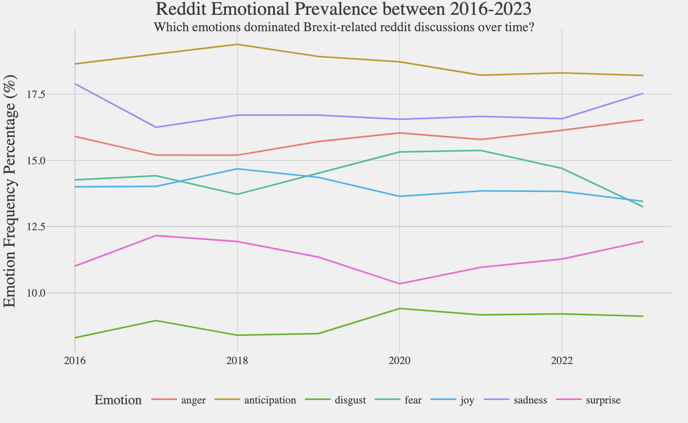
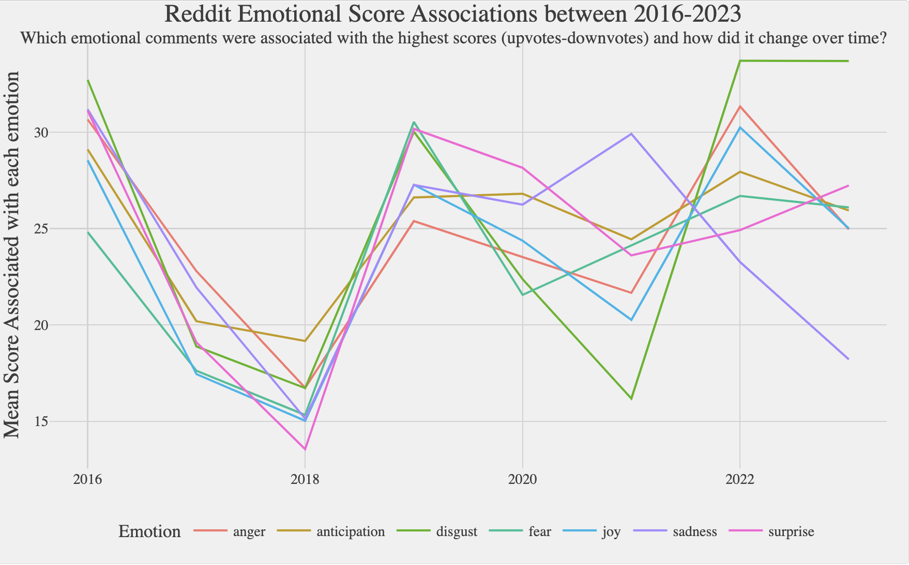

---

layout: base
---
# Sentipedia: Analyzing Emotions and Sentiment Around Brexit 
Group members: Vaibhav V, Andrew Pei, Vincent Wei, ChakHa Yeung

# 1. Introduction 

### 1.1 What is Brexit 
Brexit, short for "British exit," refers to the withdrawal of the United Kingdom (UK) from the European Union (EU). The Brexit process began with a referendum held on June 23, 2016 and officially took effect on January 31, 2020.  

### 1.2 What is the motivation for our study
Our motivations for choosing this topic revolved around some key questions?
* How did sentiment around Brexit change after three years. Is it true that people disagree with Brexit more and more?
* Are polls accurate at describing sentiment around Brexit given that they only reach a certain group of people?
* Is there a difference between sentiment around Brexit in traditional news outlets vs. social media?
* Do young people think differently about Brexit compared to the norm?

### 1.3 Research Design / Project Flow Diagram
Our project flow is summarised in the diagram below. Because reddit’s official API has several limitations on the number of pull requests and retrievable data, an API wrapper from library redditExtractoR was used to bypass its restrictions. Even though RedditExtractoR can still only obtain a limited number of posts, it is superior to the default wrapper in being able to extract all the desired information and contents of the posts. On top of this, the wrapper can restrict the query to specific subreddits, ensuring comments exclusively originate from our target audience of young British redditors. We ultimately choose the unitedkingdom subreddit, as its users represent a wider political spectrum than alternative uk politics-related subreddits, likely contains the most data points on this topic from the desired target group, and most crucially its posts mainly consist of formal news articles. Over half of the post titles are news headlines with the text consisting of the corresponding news article, leaving us with a large sample to work with. This streamlines the data collection process by simultaneously extracting the news articles and the reactions to them, allowing us to ‘kill two birds with one stone’ and avoid a separate data collection process for news articles. However, even though this method has merit in its convenience, it introduces selection bias: articles that draw the most anger and outrage are more likely to be posted on reddit. Nevertheless, given the project scope and the difficulties of matching separate news articles to reddit reactions, it probably remains the most concrete way of gaining an insight into the interaction between redditors and news articles describing Brexit-related events. 
The package also simplifies the data collection process, with just a single command needed to extract a complete data frame (top_Brexit_urls) containing the post url, timestamp, and title text. A second command then extracts the post contents into a list of dataframes (thread_contents) where the comments are indexed into a 2nd dataframe (df_Brexit). We then filtered for comments that contained the word "Brexit", which we will use for our subsequent emotional and sentimental analysis. Following the extraction, both dataframes are cleaned and wrangled using pandas from python and tidyverse in R; this process will be further detailed in the cleaning and EDA section. For subsequent analysis, with additional details and justifications provided in the section 6, thread_df’s post urls are web-scraped to obtain the article content, whereas comment_df will be preprocessed via tidytext and NLTK to assess both emotions and sentiment. The final output is then generated in the form of visualisations such as line charts, wordclouds, and barcharts. 

# 2.Initial Data Collection 

### 2

### 2.1 EDA of Reddit Post/Threads Dataframe 
Out of the 229 posts, we discovered around 150 of them contain news articles. For the subreddit posts that did not link to a news article, we removed them and replaced them with NaN so that they can be filtered out in later analysis. It was difficult to uncover any distributions for the news data frame because it was all qualitative character data types - the comments_df contains some quantitative distributions so the distributions will be discussed more in depth

### 2.2 EDA of Reddit Comments Dataframe (df_filtered) which contains "Brexit" 
Df_filtered has 11765 rows and 7 columns, with dates of comments ranging between 2016-06-24 to 2023-05-14 and an average "score" ( comment upvotes - downvotes) of roughly 22. We can find the default data types using the str command in R, which shows that only the url and comment columns are characters while the remaining 4 columns are numeric. To get a rough understanding of distributions for our relevant numeric variables, we plotted histograms of the date and score variable. It suggests there is a significant positive skew for the score variable, and and that a majority of the comments occurred in 2018-2019 and 2022-2023. However, we decided not to remove score outliers because engagement in social media platforms tends to be dominated by a small number of posts, so it is not unexpected that the distribution is non-normal. In addition, the score variable is not used as a predictor for emotional classification or sentiment analysis, so most of the results should not be affected. 

 

# 3. Data Analysis 
### 3.1 Method Choice and Reasoning for Emotional Analysis
#### 3.1.1 Emotional Word Clouds Method Reasoning: 
For the word clouds, 2-word tokens were used instead of 1-word ones because it reveals more information about the context under which the phrases were used. For example, in the unigram clouds ‘pretty’ was shown as a common ‘emotional’ word, but it reveals little about the emotional target and is merely an ‘amplifier’ used for emphasis.  Of course, the 2-word case is still flawed in being biased towards common short phrases that also lack meaning, but after selectively filtering out stopwords and non-emotional words it tends to not undermine analysis; only ‘oven-ready’ is left as a vague 2 word-phrase, and even this has some Brexit-related meaning in reference to Boris Johnson’s proclamations of an ‘oven-ready’ Brexit deal. Only the top 50 bigrams were retained so the word clouds are less distracting and more comparable.

#### 3.1.2 Emotional Classification Diagrams Method Reasoning: 
Due to time constraints, an off-the-shelf dictionary-based emotional classification model was used. While this model is more advanced than others by being able to account for some negation - for example, “I don’t hate brexit” will be recorded as anger_negated instead of misclassified as anger -  it still fails to detect more nuanced negation such as sarcasm. It records 16 emotions, but only 7 emotions were kept for visualisation. 8 emotions are just their negated counterparts, which are difficult to categorise as positive or negative emotions, while 1, trust, was excluded because it seems prone to misclassification. For example, “I'm not quite sure I agree.” is assigned the highest trust score of 1, even though it suggests uncertainty/trust_negated. Unfortunately, removing ‘one-worders’ was difficult so they were kept, which could potentially distort the analysis. However, one-worders should not be particularly biased towards any emotion and so would only be ‘random noise’. For simplicity and to keep as many comments as possible, only instances where no emotions were recorded were filtered out, so it is possible for each individual sentence in a comment to have multiple emotions as it is just based on the presence of specific dictionary words. For example, the following comment was tagged with the emotions ‘trust’, ‘disgust’, and ‘anger’: 

_“I'm wondering if their support was decided upon because they felt there was no realistic prospect of Corbyn actually pushing for a second vote which would mean it was another way they could oppose Brexit - which they consider likely to be seriously harmful to Scotland - whilst knowing that if no second vote happened then there's no way any future government in Westminster could plausibly argue for referendum on any agreed Scottish independence deal and be taken seriously.” _

### 3.2 Implementation: 
#### 3.2.1 Emotional Word Clouds Implementation: 
Uses the filtered dataframe (only comments mentioning Brexit). 
Preprocess comments by tokenising into word pairs (bigrams) that are separated into two columns, before removing stop words using a dataframe (stop_words) from the tidytext package and ‘non-emotional words’ based on whether it appears in a sentiment dictionary (sentiment).

#### 3.2.2 Emotional Classification Diagrams Implementation: 
Preprocess comments by tokenising each comment into individual sentences, before running sentimentr’s off-the-shelf emotion() function to get the recorded number of emotional instances for each sentence in a relatively clean dataframe (emotion1). That dataframe is then filtered to remove instances where 0 emotions were recorded for a particular sentence, before additional tidyverse functions were used to wrangle the data frames into a desired format for visualisation. 

# 4.Discussion of Results 
### 4.1 Emotional Classification Results Analysis
 

According to the sentiment classifier as shown in the figure above, the frequency of most emotions within comments remained somewhat constant, with fluctuations occurring only by a few percentage points YoY. There are limited changes in the relative rankings, with disgust being the least common and anticipation being the most common expressed emotion throughout the period. 
However, it is clear the ‘negative’ emotions of fear, anger, and disgust surpassed the ‘positive’ emotions of joy and anticipation, with the disparity gradually increasing over time. However, the dominance of negative emotions is probably understated; the simple dictionary-based sentiment classifier is unlikely to detect sarcasm, which in a social media context tends to employ positive words to describe a negative situation as noted by Riloff et al (2013) on twitter comments. Nevertheless, the diagram does paint a rough picture of the emotional distribution, which suggests negative emotions are becoming increasingly more prevalent compared to positive emotions. 

The second diagram below shows the mean scores associated with most emotions fluctuated over time but remained relatively similar to each other for most of the time period. Its results reinforces the idea that there was some misclassification, because comments received a similar score despite negative emotions being prominent; one might expect the more positive emotions to have noticeably lower scores. However, a conspicuous exception is disgust, which was associated with an increasingly higher score compared to all other emotion despite being the least common emotion as shown in the previous diagram. 

The strong correlation between disgust and high scores suggests it was a less ‘controversial’ emotion - people have a universal distaste for the Brexit aftermath - compared to other emotions such as anger which could be perceived as misdirected. This in turn implies the correlation might be due to disgust comments being biased towards discussing less contentious topics. However, the figure below probably disproves this- general and disgust comments share over 40 out of the 50 most common non-emotional words, with almost no differences in the log percentage usage rate between shared words. Therefore, the results imply it is the feeling conveyed rather than the topics discussed that increased the average scores of disgust-conveying comments, thus making it a significant component over time. 

 

Finally, the emotional word clouds contain bigrams on Brexit-focussed topics such as project fear, the driver shortage, and free movement, but also expand over time to the discussion of wider topics such as ‘rich people’, ‘cheap labour’, and ‘hedge funds’ and more emotional descriptors such as f-ing stupid and stupid people. The frequency of phrases such as revoke a50, the law passed to exit the EU, reflects the left-wing affiliation of redditors in the unitedkingdom subreddit. When combined with the discussion of right-wing oriented topics such as project fear and the conservative party and the derogatory descriptors, it suggests a significant portion of the reddit discussion has turned into a blame game of ‘stupid people’ who voted leave. However, this is difficult to prove with only word clouds - perhaps a well-thought-out network diagram can do a better job of confirming this theory. This theory does corroborate with the existing Brexit polling and studies, which shows nearly half of voters felt disgust towards people who voted differently from them in the Brexit referendum. 

### 4.2 Sentiment Analysis Results 
Based on the data presented below on sentiment around Brexit over time for different sources, a noticeable decline in sentiment concerning Brexit becomes evident. Specifically, sentiment pertaining to Brexit has shifted towards negative territory in the case of new articles, while remaining relatively neutral in the context of both Reddit comments discussing Brexit and Reddit comments explicitly mentioning the term "Brexit." This alignment supports the findings of conventional surveys and polls, indicating an increase in the percentage of individuals perceiving Brexit as a mistake. These figures also imply that the media, as reflected by opinions expressed in news articles, tends to adopt a more critical stance compared to the general public, represented by Reddit comments, when addressing contemporary issues. Furthermore, when examining the average sentiment over time, it becomes apparent that the average sentiment of young individuals on Reddit regarding Brexit aligns closely with that of the overall population. This observation suggests that the sentiments expressed by young Reddit users concerning Brexit closely mirror those of the wider populace.

 

Analyzing the common nouns associated with Brexit offers valuable insights into the positive and negative aspects of Brexit as discussed by the public. Focusing on the negative aspects, an intriguing observation emerges: the term "people" is the most frequently mentioned word in Reddit comments expressing negative sentiment, surpassing even the frequency of mentions of "Brexit" itself. This finding suggests that the negative sentiment surrounding Brexit is closely tied to the individuals who supported Brexit, rather than the policy itself. Remarkably, the word "people" is scarcely associated with negative news articles, implying that opinions expressed in such articles may exhibit a more indirect approach due to concerns about potential offense. In contrast, negative news articles tend to focus on specific entities, such as individuals like Boris Johnson and Theresa May, thereby highlighting a more targeted analysis compared to the broader perspective observed in negative Reddit comments. This discrepancy suggests that negative opinions expressed by young people on the internet are often rooted in generalizations, while negative news articles adopt a more specific and nuanced approach.

By examining the nouns associated with positive comments and news articles concerning Brexit, a similar pattern emerges: the term "people" remains the most frequently mentioned word in Reddit comments expressing positive sentiment, although to a lesser extent compared to negative sentiment. This suggests that individuals on both sides of the Brexit debate attribute positive and negative feelings to Brexit based on the people who support it, rather than solely focusing on the policy itself. Moreover, we observe a stronger association with words such as "EU," "MEP," and "Deal" in the context of positive sentiment, which aligns intuitively with the preference of Brexit supporters towards these aspects. Similarly, words like "Tory" and "Election" exhibit greater association with positive sentiment, which is logical considering the inclination of Tories to be in favor of Brexit.

However, it is important to recognize the limitations inherent in analyzing common nouns associated with Brexit. When considering nouns associated with both positive and negative aspects of Brexit, we observe a striking similarity, providing limited direct insight into the distinctions between these two aspects. This lack of differentiation may arise due to the sheer quantity of data analyzed, as key aspects of Brexit could potentially be overshadowed by the prevalence of high-frequency words.

# 5.Conclusion 

In conclusion, we were able to use a variety of data analysis methods to investigate the sentiment expressed by Reddit comments surrounding Brexit. We were able to answer our motivating question, is it true that people disagree with Brexit more and more through emotional classification. Negative emotions seemed to increase over time, specifically fear, anger and disgust. We feel like the true increase in negative sentiment may be understated by our difficulty classifying sarcasm as negative emotion.

We also gained insight into whether there were differences in sentiment surrounding Brexit in the news compared to social media. We found that news articles were more critical of Brexit in comparison to public opinion, especially over time as sentiment in news articles declined much more steeply over time in comparison to sentiment in Reddit comments.

In order to develop our research further, and if we had more time, we could have tried to develop our own emotional classification model with the goal of being more tailored to the topic of Brexit and perhaps able to detect sarcasm more effectively. Additionally, we could have zoomed into specific events, such as key speeches or ad campaigns. This would allow us to analyse the impact they had on sentiment, which could prove to be a useful tool to politicians as they try and decide where they allocate their campaign resources.

Furthermore, sentiment analysis like this could have wider implications as they give us different insights into what people are thinking. Many financial institutions such as the Bank of England spend vast amounts of money trying to predict people's expectations of key parameters like inflation, which they use to help set the interest rate. If data analysis methods like the ones we used can be used to create more accurate forecasts, this could have real-world benefits in the form of reduced unemployment and increased economic growth.

# 6. Footnotes: 

https://aclanthology.org/D13-1066.pdf 
 
